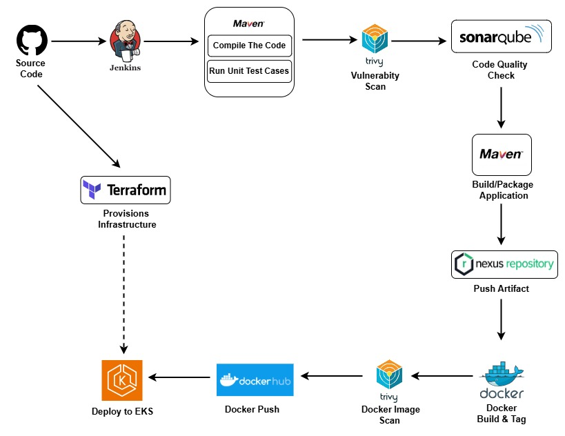

# 🚀 CI/CD Pipeline Project – Fullstack App (Spring Boot + Angular + MySQL)

This project showcases the implementation of a complete Continuous Integration and Continuous Deployment (CI/CD) pipeline using **Jenkins**, with deployment on AWS **EKS (Kubernetes)** and full **monitoring** with Prometheus and Grafana.

## 🧰 Stack Used

- **CI/CD Tools**: Jenkins, GitHub, Maven, SonarQube, Nexus
- **Containers & Orchestration**: Docker, Kubernetes (Amazon EKS)
- **Infra as Code**: Terraform (for AWS provisioning)
- **Front & Backend**: Angular (client) + Spring Boot (REST API)
- **Database**: MySQL
- **Artifact Management**: Nexus Repository

## 📂 Folder Structure
```text
.
├── backend/               # Spring Boot app
├── docs/                  # Screenshots
├── frontend/              # Angular app
├── jenkins/               # Jenkins pipeline stuff (Jenkinsfile, configs)
├── kubernetes/            # Deployment YAMLs (K8s)
├── terraform/             # All .tf files
└── README.md
```
## 📂 Architecture

This diagram represents the complete DevOps pipeline used in this project, from source code to production deployment on AWS EKS :

